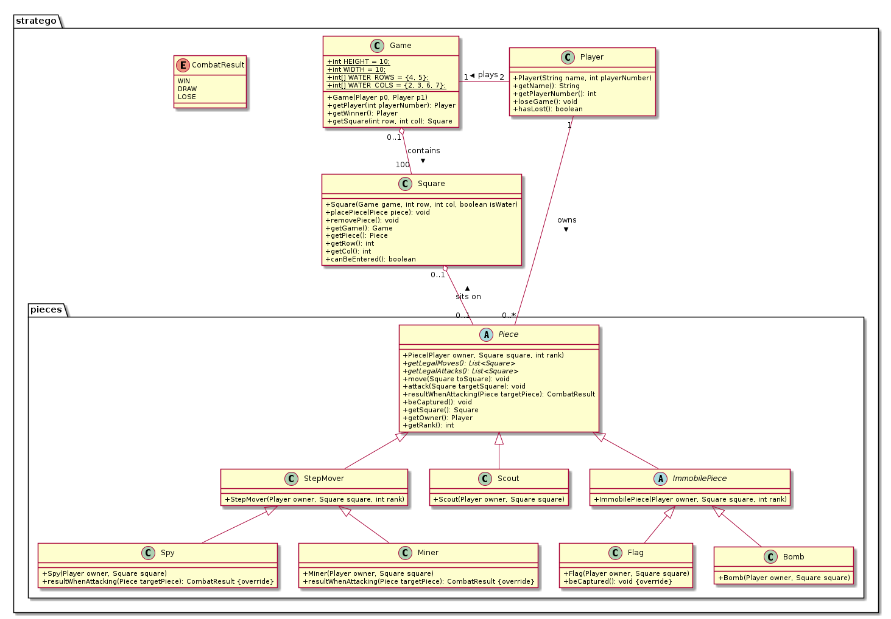

# Stratego

This Practical implements a two-player strategic board game.
The objective is to capture the opponents flag.

## Design

Design followed the provided UML diagram.



## Implementation

When implementing the Stratego game, I focused on the following:

1. Object-Oriented Principles
    - breaking down functionality into modular & reusable methods
    - expressing data structures through tailored objects
    - taking cake to ensure interoperability of diferent elements
2. Test Driven Development
    - ensuring all standard tests are satisfied
    - creating additional unit test for extension of the project

### Project extension - Terminal Game
The Terminal Game can be launched though the Main method (examples below).
It sets up a game with two players and populates a board with a handful of pieces. The exact number of pieces may vary game to game since squares are selected randomly when piecess are placed and if the square is allready occupied that piece is ommited.

The console takes input of the form (*space separated*)
```
<action> <coords> <coords>?
```
where **action** can be `move` (moves the piece on that square to another square), `attack` (make the pice on that square attack a piece on a given square),  `getmoves` (produces a list of attacks for a given square), `getattacks` (produces a list of attacks for a given square).

`move` and `attack` require **two** coordinate arguments, whereas `getmoves` and `getattacks` only need one.
Missing a second argument for `move` and `attack` will yield and `IndexOutOFBoundsException` (result of a time constraint than a design deicsion).

The coordinates ought to have the following format
```
<d1>,<d2>
```
where `d=[0-9]`.

The Players turn alternates. However, note that a player may more pieces not belonging to them and rules of the game are not strictly enforced (again, a result of a time constraint than a design deicsion).

Game will end when the flag is capture or when the program is terminated.

#### Gameplay example

```
$ user@host:~/path/CS5001-p2-stratego/src $ java stratego.Main Alice Bob
Player 1: Alice
Player 2: Bob
Populating the board
Round 0 - Player 1's turn: 
 > getmoves 1,1
Player 1's command: getmoves 1,1
Possible moves for a piece on (1,1) square:  2,1 done
        P1      P1      P1      P1                      P1      P1      P1
P1      P1      P1      P1      P1      P1      P1              P1      P1
P1              P1      P1      P1      P1      P1              P1      P1
        P1              P1      P1      P1      P1      P1              P1
                                                                          
    ...                                                                      
                                                                          
P2      P2              P2      P2      P2              P2      P2      P2
P2      P2              P2      P2      P2      P2                      P2
P2      P2      P2                      P2      P2      P2      P2      P2
P2              P2      P2      P2      P2      P2      P2      P2      P2
 ...
 > getmoves 3,7
Player 1's command: getmoves 3,7
Possible moves for a piece on (3,7) square: done
        P1      P1      P1      P1                      P1      P1      P1
P1              P1      P1      P1      P1      P1              P1      P1
P1      P1      P1      P1      P1      P1      P1              P1      P1
        P1              P1      P1      P1      P1      P1              P1
                                                                          
P2                                                                        
        P2              P2      P2      P2              P2      P2      P2
P2      P2              P2      P2      P2      P2                      P2
P2      P2      P2                      P2      P2      P2      P2      P2
P2              P2      P2      P2      P2      P2      P2      P2      P2
 > move 3,4 4,4
Player 2's command: move 3,4 4,4
Moving from (3,4) to (4,4)
        P1      P1      P1      P1                      P1      P1      P1
P1              P1      P1      P1      P1      P1              P1      P1
P1      P1      P1      P1      P1      P1      P1              P1      P1
        P1              P1              P1      P1      P1              P1
                                P1                                        
P2                                                                        
        P2              P2      P2      P2              P2      P2      P2
P2      P2              P2      P2      P2      P2                      P2
P2      P2      P2                      P2      P2      P2      P2      P2
P2              P2      P2      P2      P2      P2      P2      P2      P2
> move 4,4 5,4
Player 1's command: move 4,4 5,4
Moving from (4,4) to (5,4)
        P1      P1      P1      P1                      P1      P1      P1
P1              P1      P1      P1      P1      P1              P1      P1
P1      P1      P1      P1      P1      P1      P1              P1      P1
        P1              P1              P1      P1      P1              P1
                                                                          
P2                              P1                                        
        P2              P2      P2      P2              P2      P2      P2
P2      P2              P2      P2      P2      P2                      P2
P2      P2      P2                      P2      P2      P2      P2      P2
P2              P2      P2      P2      P2      P2      P2      P2      P2
> getattacks 5,4
Player 2's command: getattacks 5,4
Possible attacks for a piece on (5,4) square:  6,4 done
        P1      P1      P1      P1                      P1      P1      P1
P1              P1      P1      P1      P1      P1              P1      P1
P1      P1      P1      P1      P1      P1      P1              P1      P1
        P1              P1              P1      P1      P1              P1
                                                                          
P2                              P1                                        
        P2              P2      P2      P2              P2      P2      P2
P2      P2              P2      P2      P2      P2                      P2
P2      P2      P2                      P2      P2      P2      P2      P2
P2              P2      P2      P2      P2      P2      P2      P2      P2
 > attack 5,4 6,4
Player 1's command: attack 5,4 6,4
        P1      P1      P1      P1                      P1      P1      P1
P1              P1      P1      P1      P1      P1              P1      P1
P1      P1      P1      P1      P1      P1      P1              P1      P1
        P1              P1              P1      P1      P1              P1
                                                                          
P2                                                                        
        P2              P2      P2      P2              P2      P2      P2
P2      P2              P2      P2      P2      P2                      P2
P2      P2      P2                      P2      P2      P2      P2      P2
P2              P2      P2      P2      P2      P2      P2      P2      P2

```

`P1` indicated Player 1's pieces and `P2` indicated Player 2's pieces.
Players can't tell which piece is which other than implicitly though the list of their legal moves and the results of the attack.

## How to run
Navigate to the source directory and compile
```bash
$ user@host:~/path/CS5001-p2-stratego/src $ javac stratego/*.java
$ user@host:~/path/CS5001-p2-stratego/src $ java stratego.Main <arg1> <arg2>
```

### To run tests
Ensure that JUnit is installed and present in your `CLASSPATH`

```bash
$ user@host:~/path/CS5001-p2-stratego/src $ java customtests/*.java
$ user@host:~/path/CS5001-p2-stratego/src $ java customtests/TestRunner.java
Populating the board
Passed all 4 Player JUnit tests!
```
