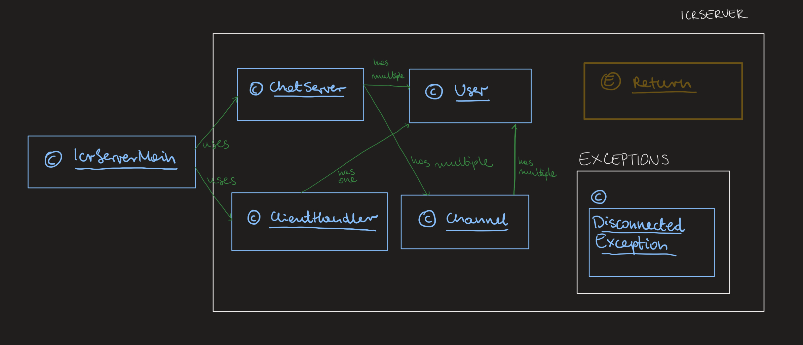

# Chat Server
The task for Pracrical 3 is to build a Java chat server which implements a simplified
version of the IRC protocol.
IRC is a protocol for text-based chat that developed gradually from the late 1980s into the early 2000s.
It was one of the first widely used chat protocols, and still forms the backend of a wide variety of chat services.

## Design

The project consists of six classes and one enum.
Is is arranged as presented on the simplified diagram below:


## How to Run
Navigate to the source directory and compile
```bash
$ user@host:~/path/CS5001-p2-stratego/src $ javac *.java
$ user@host:~/path/CS5001-p2-stratego/src $ java IrcServerMain <server name> <port>
```
For example
```bash
user@host:~/path/CS5001-p2-stratego/src $ java IrcServerMain testname 12345
Started testname on port 12345
```
