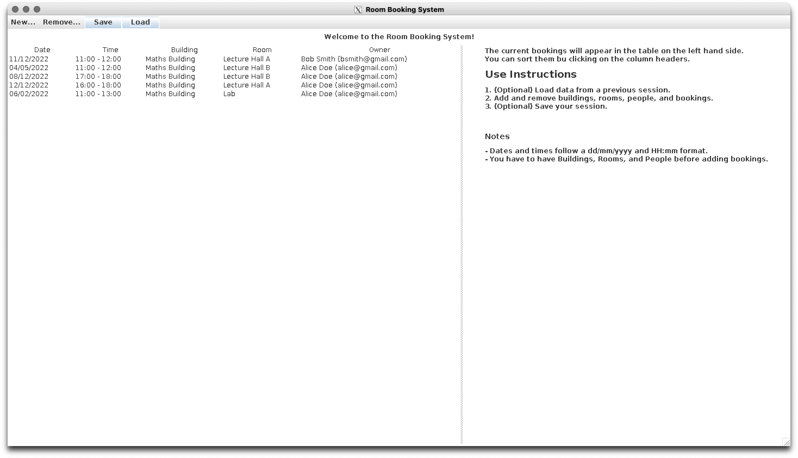

# Room Booking System

## Design
The Room Booking System follows the MVC (Model-View-Controller) design paradigm.
It consists of the three corrersponding modules and a `main` module.

### Model

The model holds the data for the booking system and the associated functionality.

The data is save to and loaded from a JSON file.
I chose to save in JSON because:
1. **JSON files are more portable than Java Serialised objects.** JSON can be used across different languages and is not limited to JAva. Also, in case the app were to be extended to use a database (especially a non-relational one), it would be easy to write a separate script loading and 
2. **JSON is human readable.** The data can be audeted easily without having to load it into a program.
3. **JSON is more flexible.** It supports serializing objects that don't implement `Serializable`, such as the `Local DateTime` (which I use as a field in a `Booking` object).
To do this, I chose to use a [Jackson Databind library](https://github.com/FasterXML/jackson-databind).

### Controller

The controller mediates between the Model (which is view agnostic) and the Views.
Is parses and passed data between the Views and the Model.

### Views

The app consistes of two views: a Command Line Interface (CLI) and a Graphical User Interface (GUI).
The both start up when running the app.
Since both are connected to the same model instance, a change in one will be propageted to the other.


## How to run

### Depndencies
The app is dependent on Jackson Databind, which itself is dependednt on Core and Annotations.
They are oncluded with the submission in the `lib` directory.

### Compiling
To compile the app, navigate to the `src` directory and run:

```bash
javac -cp "$(printf %s: ../lib/*.jar)" @sources.txt
```

### Running the system

To start the app, navigate to the `src` directory and run:

```bash
java -cp "$(printf %s: ../lib/*.jar)" roombooking.main.RoomBookingMain
```

The above will not work if you are not running from `src` since it includes a relative path to `lib`.


### Running the tests

```bash
javac -cp "$(printf %s: ../lib/*.jar)" tests/*.java
```

```bash
java -cp "$(printf %s: ../lib/*.jar)" tests.TestRunner
```

## Demo

### GUI



Screenshot of the GUI with content loaded from `data/sample_data.json`.

To view the same content:
1. Start the app.
2. Chose `Load` and select the `sample_data.json` file.

### CLI


Gif demonstrating some of the app functionality in the CLI.